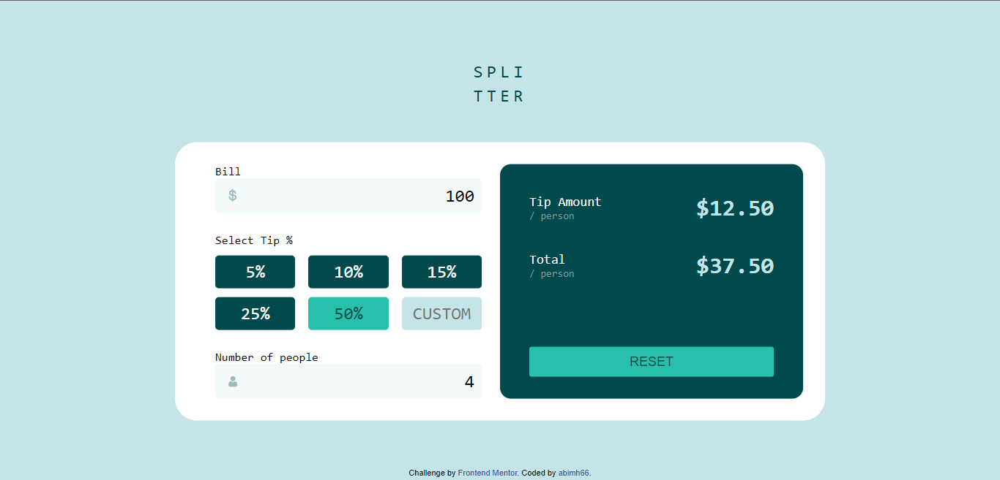

# Tip Calculator App

Project ini berdasarkan pada challenge di Frontend Mentor [Tip calculator app challenge on Frontend Mentor](https://www.frontendmentor.io/challenges/tip-calculator-app-ugJNGbJUX).

## Daftar Isi

- [Overview](#overview)
  - [Penjelasan Project](#the-challenge)
  - [Links](#links)
- [Proses](#proses)
  - [Stack yang digunakan](#stack-yang-digunakan)
  - [Resources](#resources)
- [Author](#author)

## Overview

### Penjelasan Project

Pada project ini saya membuat kalkulator untuk membagi bill(split) dan menghitung tip. Untuk desain sudah disiapkan oleh frontendmentor, saya hanya membuat tampilan semirip mungkin dengan desain menggunakan HTML dan CSS.
Objektif pada project ini:

- Menampilkan layout yang sesuai dengan ukuran layar(responsive)
- Memberikan interaksi pada web(_hover_)
- Menghitung tip yang harus dibayarkan
- Menghitung total yang harus dibayarkan

### Links

- Solution URL: [Solution Code](https://github.com/abimh66/tip-calculator-app-frontendmentor)
- Live Site URL: [live site](https://tip-calculator-abimh66.netlify.app/)

## Proses

### Stack yang digunakan

- HTML
- CSS
- CSS Flexbox
- Desktop-first workflow
- Vanilla JavaScript

### Resources

- [Mozilla MDN JavaScript Documentation](https://developer.mozilla.org/en-US/docs/Web/JavaScript)

## Author

- Website - [abiproject.com](https://www.abiproject.com)
- Frontend Mentor - [@abimh66](https://www.frontendmentor.io/profile/abimh66)
- Codewars - [@abimh66](https://www.codewars.com/users/abimh66)
- Twitter - [@abimhrdnt](https://www.twitter.com/abimhrdnt)
